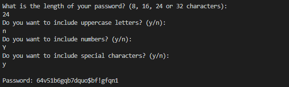

# Overview
This program will generate a customizable password.
The password has options for:
1. Length
2. Uppercase letters
3. Numbers
4. Special Characters

# Development Environment
* Visual Studio Code  
* Python 3.8.5

# Execution
Set up the program in VSCode  
Execution of the program: `python passwordgen.py`

# Useful Websites

1. [Python Reference](https://docs.python.org/3/library/index.html)
2. [Project Inspiration](https://www.upgrad.com/blog/python-projects-ideas-topics-beginners/)
3. [Useful tips for basic version](https://www.instructables.com/id/How-To-Creating-a-Random-Password-Generator-With-P/)